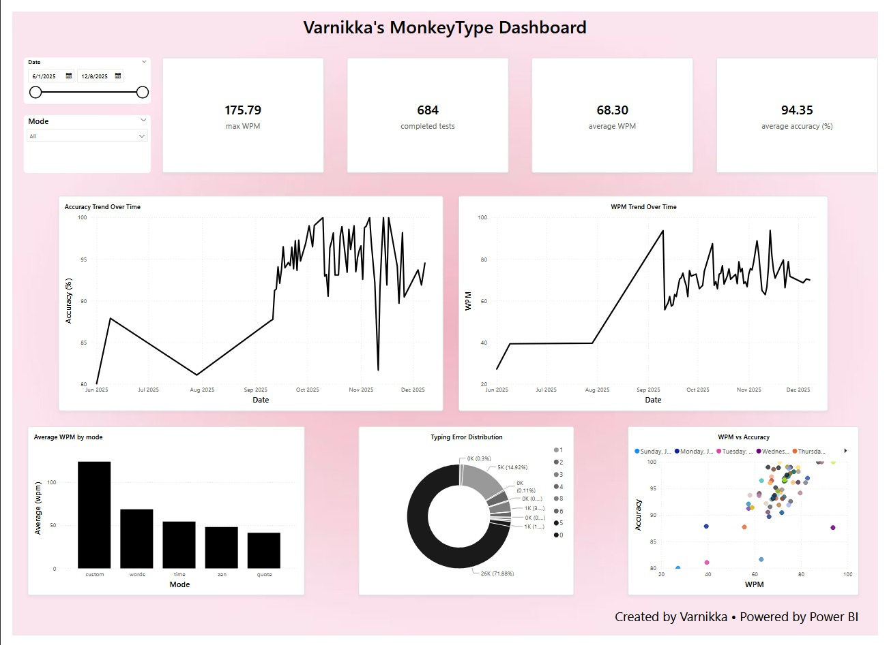

# Monkeytype Typing Performance Dashboard

## Project Overview
This project analyzes personal typing performance data collected from Monkeytype using Power BI.

The dashboard provides insights into typing speed, accuracy, error distribution, and performance trends over time.

## Tools Used
- Microsoft Power BI
- Power Query
- CSV dataset (Monkeytype export)

## Key Metrics
- Average WPM
- Maximum WPM
- Average Accuracy
- Total Completed Tests

## Visualizations
- WPM trend over time
- Accuracy trend over time
- Average WPM by mode
- Typing error distribution
- WPM vs Accuracy scatter analysis

## Key Insights
- Typing speed shows improvement over time
- Accuracy remains relatively stable across sessions
- Certain modes result in higher average WPM
- Higher speed can slightly impact accuracy

## Dashboard Preview

